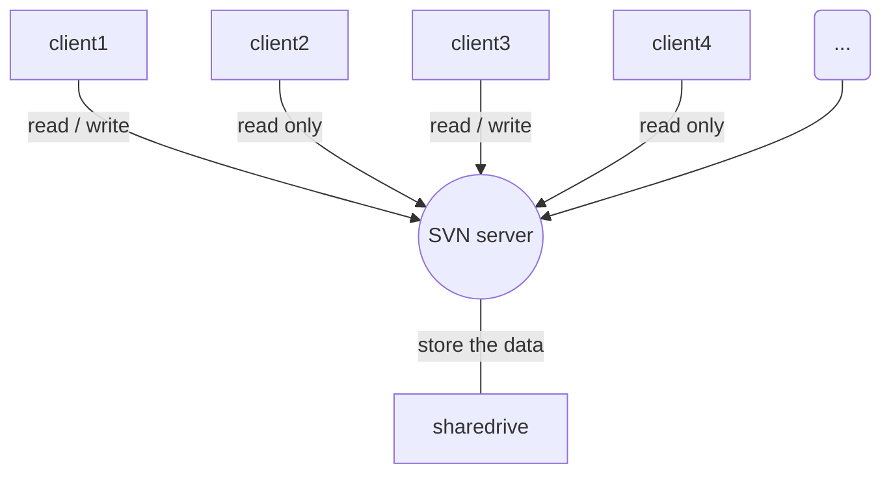

>### 准备工作

```flow
st=>start: 准备开始
e=>end: 准备完成
op1=>operation: 哈哈
op2=>operation: 哈哈
cond=>condition: 哈哈?

st->op1->cond
cond(yes)->e
cond(no)->op2->e
```


```mermaid

graph TD

    client1-->|read / write|SVN((SVN server))

    client2-->|read only|SVN

    client3-->|read / write|SVN

    client4-->|read only|SVN

    client5(...)-->SVN

    SVN---|store the data|sharedrive

```